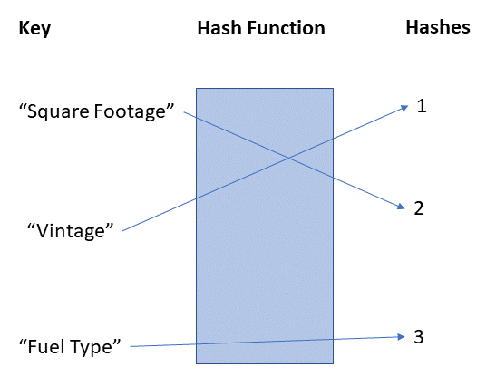
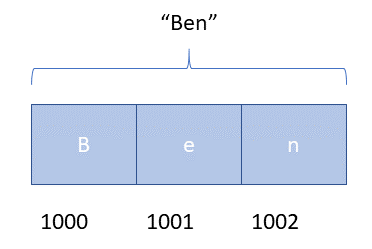

# Dictionaries

## Prerequisites

This lesson builds on the concepts from the [Objects](Objects.md) and [Lists](Lessons.md) lessons.

### Videos

Let's continue following along the videos produced by Avinash and The Codex.

* [#5 Dictionaries](https://www.youtube.com/watch?v=tcXBlk1CCx8&list=PLB5jA40tNf3scN7gwpDOx0gBm-otmXVoz&index=6)
* [#6 Tuples](https://www.youtube.com/watch?v=2Df-unA0xNA&list=PLB5jA40tNf3scN7gwpDOx0gBm-otmXVoz&index=7)


## Structured Data

Using lists, we can store collections of objects. To access an element, `L[i]`, in a list, we only need know the index of the element `i`. Lists are excellent ways to represent sequences of data. Let's say I store monthly kWh consumption over a period of 12 months in the list object `monthly_kwh`. It is a straight forward to retrieve the consumption in January, June or December using the index, `monthly_kwh[i]`.

What if we collect demographic information about the residence? Let's say we are collecting surveys and we need to represent the vintage, square footage, and heating type of the building. We could also represent this information in a list.

```
buildingInfo = [1977, 2000, 'Gas']
```

For the list to be useful, we will need to forever remember the order of items. When I want to look up the fuel type of the building, I need to first remember that fuel type is the third item in the list, and then access this element `buildingInfo[2]`.

## Dictionaries and Hashing

Dictionaries offer an easier way to store and access structured data. A dictionary stores information in key-value pairs. A key can be a string, integer, float, or any immutable object.

Dictionaries use the syntax `{"key1":"value1","key2":"value2"...}`. Let's store the building information in a dictionary. We can now access the building vintage using the `"Vintage"` index. Try it! Enter the commands below into your console.

```
buildingInfo = {"Vintage": 1977, "Square Footage": 2000, "Fuel Type": "Gas"}

buildingInfo["Vintage"]
```

How does the Python interpreter know to retrieve the correct value from the dictionary? Let's construct a mental model of the dictionary object, as it is stored in memory. The values of the dictionary are stored in an array of bytes. To access an individual element of that array, the Python interpeter needs to know the address of the starting byte.

What if the dictionary stored a lookup array, like the one below? When the program accesses the value `buildingInfo["Vintage"]`, the interpreter could search the lookup array for the key `"Vintage"`. Using the address provided in the lookup table, the interpreter could then access the *value* stored at address 1010.

```
lookup_arr = ["Vintage", 1000, "Square Footage", 1010, "Fuel Type", 1020]
```

As our dictionary grows, the time it takes to search the lookup table will also grow. Another way of saying this is to say the algorithm has a complexity of `O(N)`. **A better solution will take a constant amount of time, `O(1)`.**

Dictionaries actually use **hash tables** to store and retrieve information. A hashing function generates a number for each key in the dictionary. The hash is then mapped to an address block. To look up the value `buildingInfo["Vintage"]`, the Python interpreter computes the hash of the string "Vintage". The interpreter uses this hash to look up the address of the value. Hash tables have `O(1)` complexity, meaning that the lookup time remains constant, regardless of the size of the dictionary.



## Mutable and Immutable Objects

A closely related concept is **"mutability"** of objects. When you declare a variable in memory, the value of the variable is stored in a block of bytes. The variable itself is set up to point at the starting byte of its value.

Let's say we initialize the variable `name = "Ben"`. The string "Ben" is stored in memory, starting at byte 1000. The variable `name` now points at address 1000. When you access the variable `name`, the Python interpreter looks up the starting address 1000, reads the bytes at this address, and returns the value `"Ben"`.



What happens if you change the value of the variable `name`? Let's say we perform the following two operations in sequence.

```
name = "Ben"
name = "Kat"
```

The first line stores the string `"Ben"` in some block of memory, and tells the variable `name` to point at that block of memory. The second line stores the string `"Kat"` in memory, and reassigns the variable `name` to point at this new memory address. The important point here is that the string `"Ben"` still exists in memory! We cannot access the string, however, because our variable now points at a new memory address.

**Python cannot overwrite the values of the bytes, because strings are immutable.** To reassign a string variable, Python stores the new value in a completely new set of bytes. Immutable objects will always have the same hash.

**Objects are either mutable or immutable.** The most obvious mutable type of object is a list. You can add values to a list, delete items from the list, and otherwise change its identity by **overwriting the list's representation in memory**. When you remove an item from a list, the Python interpreter actually overwrites the bytes represeting the list object.

The value of a mutable object can change, which means that the hash of that object can also change. If we used mutable objects as keys in dictionaries, there is some potential confusion if the mutable object changes after we create the dictionary. The key insight here is that **only immutable types can be used as keys for dictionaries.**
